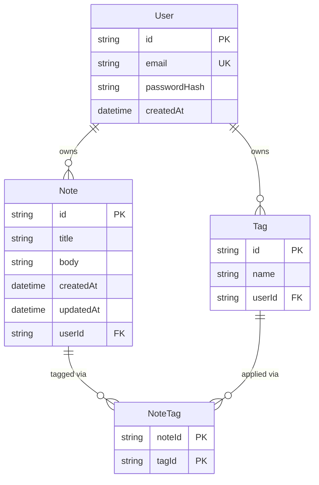

# Notes

A multi-tenant notes app. Sign up, sign in, and manage notes that only you can see — tag them, filter by tag, sort by date, and search by title. Every read and write is scoped to the signed-in user in the database query itself, not just checked in application code.

**Live URL:** https://notes-app-v19s-three.vercel.app

**Reviewer test account:**
- Email: `reviewer@example.com`
- Password: `reviewer-seed-password`

A second seeded account (`second-user@example.com`) exists with a completely different set of notes and tags, to demonstrate isolation between users.

---

## 1. Running locally

### Prerequisites

- Node.js 20+ (built and tested on Node 26)
- npm
- A [Neon](https://neon.tech) Postgres database — the app connects through `@prisma/adapter-neon` (Neon's serverless HTTP/WebSocket driver, not a raw TCP connection), so it specifically needs a Neon connection string, not just any Postgres instance
- A second, separate Neon branch/database for running tests against (never the dev database — see [Testing approach](#5-testing-approach-and-where-tdd-drove-the-implementation) below)

### Setup

```bash
npm install                          # also runs `prisma generate` (postinstall)
cp .env.example .env
```

Fill in `.env`:

| Key | Where it comes from |
|---|---|
| `DATABASE_URL` | Neon's **pooled** connection string — used by the app at runtime |
| `DIRECT_URL` | Neon's **direct** (unpooled) connection string — used only for migrations |
| `JWT_SECRET` | Any random string, e.g. `openssl rand -base64 32` — the app throws at startup if this is missing |
| `SEED_REVIEWER_EMAIL` / `SEED_REVIEWER_PASSWORD` | Optional — override the reviewer account's seeded credentials. Defaults to the values above if unset |

```bash
npx prisma migrate dev     # applies the committed migrations
npx prisma db seed         # idempotent — safe to run again
npm run dev                # http://localhost:3000
```

### Tests

Tests run against a **separate** database — never the dev one (`test/setup.ts` truncates all tables in `beforeEach`, and running that against dev data would be destructive). Create `.env.test` (gitignored) pointing at a second Neon branch:

```bash
# .env.test
DATABASE_URL=<pooled connection string for a SEPARATE Neon branch>
JWT_SECRET=<any string>
```

`vitest.config.mts` loads `.env` then `.env.test` (test branch wins) before any test file imports run, so `npm run test` never touches the dev database. Then:

```bash
npm run test        # vitest run — 113 tests across 13 files
npm run lint         # eslint, including the full jsx-a11y recommended ruleset
npx tsc --noEmit     # typecheck
```

---

## 2. Architecture at a glance

- **Next.js 16, App Router, single deployment.** Route handlers give a real HTTP API; Server Components read through the same service layer directly, with no self-fetch.
- **Strict layering:** route handlers authenticate → validate → delegate → respond, with no business logic and no direct Prisma access. All database access lives in `lib/**/service.ts` files, every exported function scoped by `userId` as its first parameter.
- **Ownership enforced in the query itself** — `findFirst`/`updateMany`/`deleteMany` all carry `{ id, userId }` in their `where` clause, never a fetch-then-compare in application code. A mutation that matches zero rows throws `NotFoundError` (404), never 403 — a 403 would confirm the resource exists.

---

## 3. Database schema



**`User` → `Note`, `User` → `Tag`: one-to-many.** A user owns their notes and their tags outright; both cascade-delete when the user is deleted.

**`Note` ↔ `Tag`: many-to-many, through an explicit `NoteTag` join model** — not Prisma's implicit many-to-many. The join table is visible in the schema and directly queryable in tests (several ownership and cascade tests assert on `NoteTag` rows directly), it can carry metadata later without a migration to introduce a table that didn't exist before, and it's what the brief asks to see. Deleting a note removes its `NoteTag` rows (cascade) but leaves the tag itself untouched — tested directly.

**`Tag` is unique on `[userId, name]`, not globally unique.** Notes are private, so a shared global tag vocabulary would leak information — one user could enumerate another's tag names by trying to create a tag that already exists. Scoping the uniqueness constraint to the pair means two different users can each own a tag called `"work"` with no collision, and the same is true of two different users applying the identical filter shape (tested directly: each sees only their own matching notes).

**`NoteTag`'s primary key is the composite `[noteId, tagId]`**, not a surrogate `id`. It's the natural key for a pure join row — a note either has a given tag or it doesn't, so the pair itself is the identity, and the composite key enforces that a note can't carry the same tag twice without needing a separate unique constraint to say so.

---

## 4. Tradeoffs and shortcuts

Specific, not hand-wavy — these are real gaps, not implied confidence the app doesn't have:

- **Note creation and tag attachment are not atomic across the two calls.** `POST /api/notes` calls `createNote`, then separately calls `setNoteTags`. Each is its own transaction. If a `tagId` in the request doesn't belong to the caller, the note has already been created by the time the tag attachment is rejected — the response is `404`, but a real (untagged) note is left in the database. This only happens on a malformed or adversarial direct API call; the UI's tag picker only ever offers tags the signed-in user already owns, and there's no cross-user leak either way. Fixing it properly means `lib/notes/service.ts` learning about tag-ownership rules that currently live entirely in `lib/tags/service.ts`.
- **`listNotes` doesn't independently re-verify that filter `tagIds` belong to the caller.** It relies on an invariant instead: a `NoteTag` row can only exist because `setNoteTags` already checked both the note and the tag belong to the same user, so a note owned by A can never carry a join row pointing at a tag owned by B. This is tested directly (filtering by a foreign tag id returns zero results, not someone else's notes), but it's a transitive guarantee, not a local one — an explicit ownership check inside `listNotes` too would be a defensible "belt and suspenders" addition.
- **Multi-tag filtering is AND only**, not configurable. Given no signal either way in the brief, AND was chosen because it matches how "filter" normally reads (narrows as you add tags). OR is arguably more useful once a tag vocabulary gets large, and isn't available as an option.
- **A malformed `searchParams` value on `/notes` silently falls back to defaults** rather than showing an error — a hand-edited URL with `?sort=bogus` just gets treated as if `sort` weren't there. The equivalent API request (`GET /api/notes?sort=bogus`) correctly 400s. Two different policies for the same schema, deliberately, but worth knowing about.
- **No modals anywhere in the UI.** Edit is inline (the note card swaps its display for a form in place) and delete uses a two-step inline confirmation, specifically to avoid the focus-trap/Escape/return-focus implementation a modal would require. This is a real scope reduction, not just a style preference — it means there's no dialog pattern implemented or exercised anywhere in the app.
- **No rate limiting or brute-force protection on `/api/auth/signin`.** Timing is equalized (a dummy bcrypt comparison runs on an unknown-email attempt, so response time doesn't reveal which emails are registered), but there's no limit on how many attempts a client can make.
- **UI components have no dedicated automated tests.** Per this project's own testing policy, validation schemas, auth primitives, auth flows, every ownership rule, and the filter/sort/search logic were written test-first; UI wiring and presentational components were not, and were instead verified by hand against a running server (curl against real endpoints, checking the actual HTML) and by TypeScript's own type checking. There is no React Testing Library or Playwright coverage.
- **No CI pipeline.** `lint`, `test`, `tsc --noEmit`, and `build` were run manually at the end of every phase, not automatically on push.
- **Depends on Node's global `WebSocket`, not the `ws` package.** `@neondatabase/serverless` needs a WebSocket constructor for transactions; Node 22+ exposes one globally, which is what this was built and deployed against. An older Node runtime would need `ws` added back as a dependency.

---

## 5. Testing approach and where TDD drove the implementation

113 tests across 13 files (`npm run test`), all against a real database — no Prisma mocking, since the ownership guarantees this app is actually about are only meaningful proven against a real query.

**Written test-first, verifiable in git history — every one of these phases has a `test:` commit that adds failing tests against code that doesn't exist yet, followed by a separate `feat:` commit that makes them pass:**

- Validation schemas (`lib/validation/`) — every shape crossing a network boundary
- Auth primitives (`lib/auth/password.ts`, `lib/auth/jwt.ts`) — hashing, token signing/verification, tamper and expiry detection
- Auth API flows (`/api/auth/*`) — including the timing-safe signin behavior
- Every ownership rule in the notes and tags services
- The tag-filter/sort/search logic, including AND semantics

**The ownership tests are the ones that actually shaped the code**, not just checked it afterward. Tests like:

- `"throws NotFoundError for another user's note id"`
- `"throws NotFoundError for another user's note id and leaves the row unchanged"` (update)
- `"throws NotFoundError for another user's note id, and the row still exists afterwards"` (delete)
- `"rejects another user's tag id and writes no join rows"`

...can only pass if ownership is checked inside the database query itself — a fetch-then-compare in application code would still leak *which* rows exist to the calling code, and there'd be no way to write "and leaves the row unchanged" as a real assertion instead of an implication. This is what forced every service function's signature to start with `userId`, and forced every mutation to go through `findFirst`/`updateMany`/`deleteMany` with ownership in the `where` clause rather than a plain `findUnique` followed by an `if` check.

**One regression test caught a real bug before the fix, not after:** once `createNoteSchema`/`updateNoteSchema` grew an optional `tagIds` field (Phase 9, tags), a test asserting `createNote`/`updateNote` should ignore that field failed with an actual `PrismaClientValidationError: Unknown argument tagIds` — both functions were spreading their entire validated input straight into Prisma's `data` argument. The test was written and committed failing first, showing the real error, then the fix (naming fields explicitly instead of spreading) made it pass.

**Written test-after:** UI wiring and presentational components — verified live against a running server instead (see [Tradeoffs](#4-tradeoffs-and-shortcuts) above).

---

## 6. What would be improved with more time

- Make note creation and tag attachment one atomic transaction, closing the partial-success gap described above.
- Add an explicit tag-ownership check inside `listNotes` for defense in depth, instead of relying on the (proven, tested, but transitive) invariant that `setNoteTags` already enforces it.
- Make the AND/OR tag-filter semantics a user-facing toggle instead of a fixed choice.
- Add component-level tests (React Testing Library) for the interactive pieces — forms, the delete confirmation flow, the tag multi-select — instead of relying on live manual verification and TypeScript alone.
- Add a CI pipeline running lint, test, typecheck, and build on every push, instead of running them by hand.
- Add rate limiting on the auth endpoints.
- Color contrast was verified by computing actual WCAG ratios for every color pair in use (documented in `DECISIONS.md`), and one real failure was found and fixed this way — but that's a substitute for, not the same as, running axe DevTools and Lighthouse in a live browser. Lighthouse was later run against the deployed site and scored **100 on accessibility for `/notes`**; a full axe DevTools pass across every page (login, signup, empty states, error states) is still worth doing.
- Pagination for the notes list, which is currently unbounded.

---

## 7. How AI coding tools were used

This app was built with **Claude Code**, working phase-by-phase from a fixed spec (`requirements.md`) and a binding engineering-rules document (`CLAUDE.md`), both supplied at the start and treated as authoritative throughout. Every phase followed the same pattern: for anything designated test-first, write failing tests and commit them, then implement, then commit the passing implementation, then log any non-obvious decision in `DECISIONS.md` with its reasoning and rejected alternative.

**What was generated:** essentially all of it — the schema and migrations, the seed script, every validation schema, the auth primitives and API routes, the notes and tags service layers and their API routes, the filter/sort/search logic, every React component, and all 113 tests, across 14 phases. Nothing in this codebase was scaffolded by a template beyond `create-next-app`'s initial commit.

**What was corrected — specific bugs, found and fixed in the same process, not glossed over:**

- **A silently-broken test alias.** `vitest.config.ts` (a plain `.ts` file using `export default`) had its `resolve.alias` silently fail to apply, because Vite's config loader couldn't unambiguously tell if the file was ESM or CommonJS. The `@` import alias just didn't resolve. Renamed to `.mts` to force unambiguous ESM parsing, which fixed it — caught before it could cause confusing "module not found" failures in every subsequent test file.
- **`cookies()` from `next/headers` throwing outside a request scope.** This project's own testing convention (calling exported route handlers directly, no running server) doesn't provide the Next.js request context that API relies on. Discovered empirically while writing Phase 4's auth-route tests, fixed by moving cookie *writes* onto the `NextResponse` object directly; the same problem resurfaced for cookie *reads* once notes routes needed `requireUser()` in Phase 7, and was resolved with an optional request parameter read directly off the request instead of `next/headers`.
- **A real Prisma runtime bug, caught by a test written before the fix.** Described above in the testing section: `createNote`/`updateNote` blindly spreading their whole input into Prisma's `data` argument broke the moment the schema grew a field that wasn't a database column. The regression test failed with the actual `PrismaClientValidationError` before any fix existed.
- **A misleading dev-server false alarm, correctly diagnosed rather than patched around.** A live check of the AND tag filter appeared to return an untagged note — looked like a real bug. Rather than change the filter code to match the wrong-looking output, called `listNotes()` directly against the same database, which returned the *correct* result, proving the code was right and a long-running dev server's stale compile was the actual cause. Confirmed again after a cache clear.
- **A database outage silently misrepresented as "you're not logged in."** Found during the Phase 11 error-handling audit: `getCurrentUser()`'s blanket `try/catch` treated a database connection failure exactly like an invalid session token, both resulting in a quiet redirect to `/login`. Verified the fix by actually breaking `DATABASE_URL` against a production build and confirming the corrected behavior (a real 500 with no leaked detail) rather than assuming the fix worked.
- **Four client-side `fetch` calls with no failure path.** Found by systematically grepping every `fetch(` call in the codebase and checking each one individually, rather than assuming they all matched the three that were already correct. A network failure in any of the four would have left the UI stuck pending forever with no message shown.
- **`eslint-plugin-jsx-a11y`'s recommended ruleset was only 6 of 34 rules.** Next's bundled config included a small subset; this went unnoticed until the Phase 12 audit explicitly counted the active rules against the documented recommended set and found the gap.
- **A real WCAG contrast failure.** `text-zinc-500` was reused unchanged for both light and dark mode body text. It passed at 4.83:1 on a white background — comfortably — but computed to 4.10:1 against the dark-mode background, under the 4.5:1 minimum. Found by computing actual contrast ratios for every color pair in use, not by inspection.
- **Two contradictions inside `CLAUDE.md` itself**, resolved by checking authoritative sources instead of guessing: `proxy.ts`'s export style (one section said named export, another implied default) was resolved by reading Next.js 16's own source for how it resolves the handler, then correcting the document to remove the contradiction; a `.gitignore` bug (a blanket `.env*` pattern that also silently excluded `.env.example`, meaning it could never be committed) was found while wiring up environment configuration and fixed with an explicit negation.

**What was rejected or overridden by explicit direction, not the AI's default choice:** a few points in the build hit a genuine fork where the spec gave no signal, and those were escalated rather than guessed at. Whether `lib/auth/session.ts` should import Prisma directly (conflicting with this project's strict layering rule) or delegate through a small new service file was presented as an explicit choice; the latter was chosen and built. Whether multi-tag filtering should use AND or OR semantics was left as an open, explicitly-flagged placeholder across nine phases specifically because the brief gave no signal either way, and was only implemented once directed which one to build, along with the requirement to test that specific behavior.

No claim in this document describes a check that wasn't actually run: every "verified," "tested," or "confirmed" statement above corresponds to a real command that was executed and whose output was read, not an assumption about what probably would have happened.
